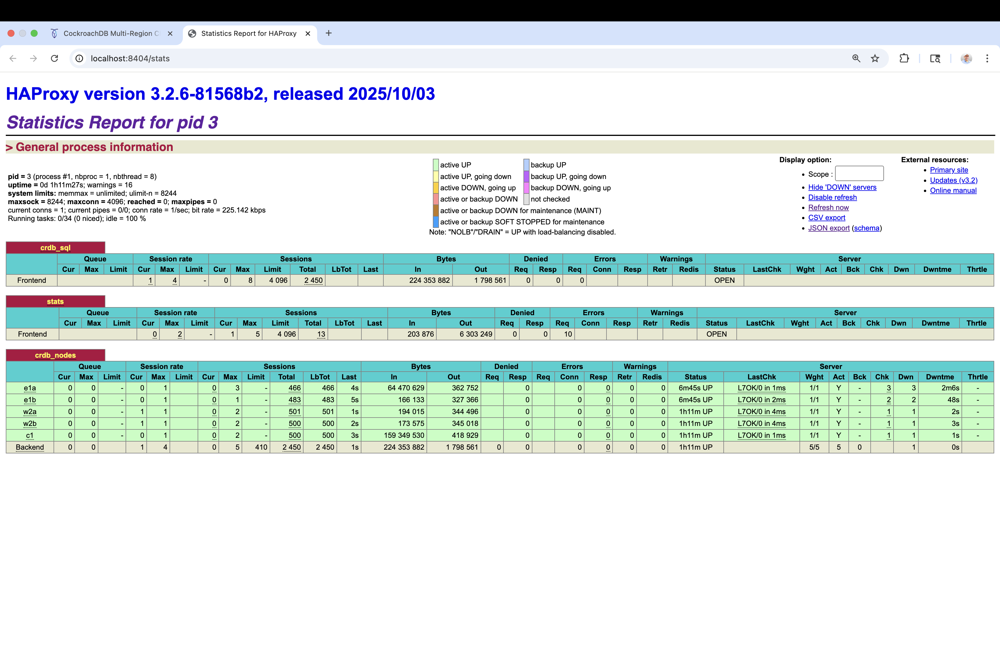

# 🪲 CockroachDB Multi-Region Chaos Demo

Interactive demonstration of CockroachDB's resilience during network partitions.




## 🚀 Quick Start

```bash
./run.sh
```

**Using a different CockroachDB version:**
```bash
CRDB_VERSION=v25.3.0 ./run.sh
```

Wait ~10 seconds, then open: **http://localhost:8088**

## Demo Flow

### Quick Demo (30 seconds)

1. **All regions green** → click "Recover" on each if needed
2. **Click "🚀 Simulate Transactions"** → watch counter increment  
3. **Click "⚡ Partition" on us-east-1** → region turns red
4. **Click "🚀 Simulate Transactions" again** → still works! ✨
5. **Check admin console** → http://localhost:8080 → nodes marked as SUSPECT/DEAD
6. **Check HAProxy stats** → http://localhost:8404/stats → partitioned nodes show RED
7. **Click "✓ Recover"** → nodes rejoin cluster and turn green

### Chaos Scenarios Explained

**🟢 Recover:** Restores region connectivity and restarts any killed nodes.

**🟡 Brownout (Degraded Performance):**
- Adds configurable network latency (default 700ms) via Toxiproxy
- Simulates slow/degraded network connections
- Great for testing timeout handling and query performance under latency
- CockroachDB continues operating but with slower response times

**🟠 Partition (Network Partition):**
- **True network partition** using Docker network disconnect
- Nodes become completely isolated from the cluster
- CockroachDB will mark them as SUSPECT (after ~5 seconds) then DEAD (after ~9 seconds)
- HAProxy detects unhealthy nodes and reroutes traffic automatically
- Nodes stay running but cannot communicate - check admin console to see them go SUSPECT/DEAD
- **Key Demo Point:** This shows CockroachDB's consensus-based resilience during network splits

**🔴 Kill (Abrupt Node Failure):**
- Uses `docker kill -s SIGKILL` (like kill -9)
- Simulates catastrophic crash/hardware failure (not graceful shutdown)
- Nodes are terminated immediately without cleanup
- CockroachDB cluster continues operating on remaining nodes
- HAProxy immediately marks dead nodes as DOWN and reroutes
- **Key Demo Point:** Shows resilience against sudden node crashes

## Architecture

```
┌─────────────────────────────────────────────────────────┐
│              HAProxy (localhost:26257)                  │
│           Routes SQL to healthy regions                 │
└───────────┬──────────────┬──────────────┬───────────────┘
            │              │              │
    ┌───────▼──────┐ ┌─────▼──────┐ ┌────▼──────┐
    │ Toxiproxy    │ │ Toxiproxy  │ │ Toxiproxy │
    │  us-east-1   │ │ us-west-2  │ │us-central │
    │  (network)   │ │  (network) │ │ (network) │
    └───────┬──────┘ └─────┬──────┘ └────┬──────┘
            │              │              │
    ┌───────▼──────┐ ┌─────▼──────┐ ┌────▼──────┐
    │ 2 CockroachDB│ │2 CockroachDB│ │1 CockroachDB
    │    Nodes     │ │   Nodes    │ │   Node    │
    └──────────────┘ └────────────┘ └───────────┘
              ╲           |           ╱
               ╲          |          ╱
                  CockroachDB Cluster
              (nodes communicate directly)
```

**What happens during chaos:**
- **Partition:** Nodes isolated via Docker network disconnect → marked SUSPECT/DEAD by CockroachDB
- **Kill:** Nodes terminated with SIGKILL → immediate failure, no graceful shutdown
- **Toxiproxy:** Used for Brownout (latency injection) only, not for network partition
- ✅ HAProxy automatically detects unhealthy backends and routes to healthy regions

## Configuration

**CockroachDB (default: v25.4.0, configurable via CRDB_VERSION)** with:
- ✅ Vector index enabled (for embeddings)
- ✅ Buffered writes enabled (performance)
- ✅ 5 nodes across 3 regions
- ✅ Region locations configured

**Database:** `defaultdb` (ready to use)

**Connection String:**
```
postgresql://root@localhost:26257/defaultdb?sslmode=disable
```

## Using with [Banko AI](https://github.com/cockroachlabs-field/banko-ai-assistant-rag-demo)

Point your [Banko AI](https://github.com/cockroachlabs-field/banko-ai-assistant-rag-demo) app to the connection string above. Your app will:
- Create its own tables automatically
- Handle brief connection errors during failover
- Continue operating when regions are "killed"

**Expected behavior during chaos events:**

Partition:
- ⚠️ Nodes marked SUSPECT (~5s) then DEAD (~9s) in admin console
- ✅ HAProxy reroutes traffic to healthy regions within seconds
- ✅ All committed data remains available
- ✅ Transactions continue on available nodes

Kill:
- ⚠️ Immediate node termination (SIGKILL)
- ✅ HAProxy detects failure and reroutes instantly
- ✅ Cluster continues with remaining nodes
- ✅ No data loss (replicas on other nodes)

Brownout:
- ⚠️ Queries slow down (configurable latency)
- ✅ All operations eventually complete
- ✅ Tests application timeout handling

See http://localhost:8080 to monitor node status and liveness during chaos events.

## Why Toxiproxy?

Toxiproxy is used **only for Brownout scenarios** to inject configurable network latency. For true network partitions, we use Docker network disconnect to properly isolate nodes, which is the recommended approach per [CockroachDB documentation](https://www.cockroachlabs.com/docs/stable/cluster-setup-troubleshooting#network-partition).

This approach ensures:
- Network partitions properly trigger CockroachDB's consensus mechanism
- Nodes are marked as SUSPECT then DEAD (observable in admin console)
- HAProxy health checks accurately reflect node availability
- Brownout scenarios test application timeout handling

## Additional Dashboards

- **Chaos Panel:** http://localhost:8088
- **CockroachDB Console:** 
  - http://localhost:8080 (crdb-e1a - us-east-1a)
  - http://localhost:8081 (crdb-e1b - us-east-1b)
  - http://localhost:8082 (crdb-w2a - us-west-2a)
  - http://localhost:8083 (crdb-w2b - us-west-2b)
  - http://localhost:8084 (crdb-c1 - us-central-1a)
- **HAProxy Stats:** http://localhost:8404/stats

**Note:** Each node serves its own admin console. If you kill crdb-e1a, use port 8081 or 8082 to access the console from a different node!

## Troubleshooting

**All regions show UNREACHABLE:**
- Wait 10 seconds for initialization
- Click "Recover" on each region

**Connection errors in app:**
- Expected during failover (1-2 seconds)
- Check your app has retry logic
- Verify HAProxy routing: http://localhost:8404/stats

**Admin console shows nodes down:**
- This shouldn't happen - nodes stay alive
- Check docker containers: `docker ps`

## Stop Demo

```bash
docker compose down -v
```

## Technical Details

**Stack:**
- CockroachDB (default v25.4.0, set via CRDB_VERSION env var)
- HAProxy LTS (load balancer)
- Toxiproxy 2.9.0 (network partition simulator)
- Python FastAPI (chaos panel)

**Security Note:** Insecure mode for demos only. Production requires certificates.

## Optional: Multi-Region Database Setup

For advanced testing, configure defaultdb as multi-region:

```sql
ALTER DATABASE defaultdb SET PRIMARY REGION "us-east-1";
ALTER DATABASE defaultdb ADD REGION "us-west-2";
ALTER DATABASE defaultdb ADD REGION "us-central-1";
ALTER DATABASE defaultdb SET SECONDARY REGION "us-west-2";
```

This enables regional table placement, follower reads, and lower latency.

---

**🪲 Survive anything. Run anywhere.**
