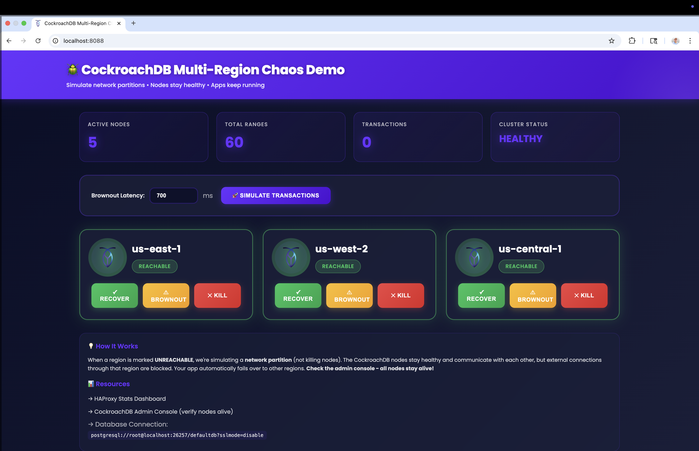

# 🪲 CockroachDB Multi-Region Chaos Demo

Interactive demonstration of CockroachDB's resilience during network partitions.



## 🚀 Quick Start

```bash
./run.sh
```

**Using a different CockroachDB version:**
```bash
CRDB_VERSION=v24.3.0 ./run.sh
```

Wait ~10 seconds, then open: **http://localhost:8088**

## Demo Flow (30 seconds)

1. **All regions green** → click "Recover" on each if needed
2. **Click "🚀 Simulate Transactions"** → watch counter increment  
3. **Click "✕ Kill" on us-east-1** → region turns red
4. **Click "🚀 Simulate Transactions" again** → still works! ✨
5. **Check admin console** → http://localhost:8080 → all nodes still alive!
6. **Click "✓ Recover"** → back to green

**Key Point:** We're simulating **network partitions**, not node failures. The CockroachDB cluster stays healthy internally.

## Architecture

```
┌─────────────────────────────────────────────────────────┐
│              HAProxy (localhost:26257)                  │
│           Routes SQL to healthy regions                 │
└───────────┬──────────────┬──────────────┬───────────────┘
            │              │              │
    ┌───────▼──────┐ ┌─────▼──────┐ ┌────▼──────┐
    │ Toxiproxy    │ │ Toxiproxy  │ │ Toxiproxy │
    │  us-east-1   │ │ us-west-2  │ │us-central │
    │  (network)   │ │  (network) │ │ (network) │
    └───────┬──────┘ └─────┬──────┘ └────┬──────┘
            │              │              │
    ┌───────▼──────┐ ┌─────▼──────┐ ┌────▼──────┐
    │ 2 CockroachDB│ │2 CockroachDB│ │1 CockroachDB
    │    Nodes     │ │   Nodes    │ │   Node    │
    └──────────────┘ └────────────┘ └───────────┘
              ╲           |           ╱
               ╲          |          ╱
                  CockroachDB Cluster
              (nodes communicate directly)
```

**What "Kill" does:**
- ❌ Blocks external connections through Toxiproxy
- ✅ Nodes stay alive and communicate internally
- ✅ HAProxy automatically routes to healthy regions

## Configuration

**CockroachDB (default: v25.3.3, configurable via CRDB_VERSION)** with:
- ✅ Vector index enabled (for embeddings)
- ✅ Buffered writes enabled (performance)
- ✅ 5 nodes across 3 regions
- ✅ Region locations configured

**Database:** `defaultdb` (ready to use)

**Connection String:**
```
postgresql://root@localhost:26257/defaultdb?sslmode=disable
```

## Using with [Banko AI](https://github.com/cockroachlabs-field/banko-ai-assistant-rag-demo)

Point your [Banko AI](https://github.com/cockroachlabs-field/banko-ai-assistant-rag-demo) app to the connection string above. Your app will:
- Create its own tables automatically
- Handle brief connection errors during failover
- Continue operating when regions are "killed"

**Expected behavior when killing a region:**
- ⚠️ 1-2 brief connection errors (during failover)
- ✅ Automatic recovery within seconds
- ✅ All committed data safe
- ✅ Cluster shows 5 healthy nodes in admin console

See http://localhost:8080 to verify nodes stay alive during region kills.

## Brownout Mode

Test latency tolerance:
1. Set latency (default 700ms) in the UI
2. Click "⚠ Brownout" on a region
3. Watch transactions slow but continue
4. Shows CockroachDB handles degraded networks

## Additional Dashboards

- **Chaos Panel:** http://localhost:8088
- **CockroachDB Console:** 
  - http://localhost:8080 (crdb-e1a - us-east-1a)
  - http://localhost:8081 (crdb-e1b - us-east-1b)
  - http://localhost:8082 (crdb-w2a - us-west-2a)
  - http://localhost:8083 (crdb-w2b - us-west-2b)
  - http://localhost:8084 (crdb-c1 - us-central-1a)
- **HAProxy Stats:** http://localhost:8404/stats

**Note:** Each node serves its own admin console. If you kill crdb-e1a, use port 8081 or 8082 to access the console from a different node!

## Troubleshooting

**All regions show UNREACHABLE:**
- Wait 10 seconds for initialization
- Click "Recover" on each region

**Connection errors in app:**
- Expected during failover (1-2 seconds)
- Check your app has retry logic
- Verify HAProxy routing: http://localhost:8404/stats

**Admin console shows nodes down:**
- This shouldn't happen - nodes stay alive
- Check docker containers: `docker ps`

## Stop Demo

```bash
docker compose down -v
```

## Technical Details

**Stack:**
- CockroachDB (default v25.3.3, set via CRDB_VERSION env var)
- HAProxy LTS (load balancer)
- Toxiproxy 2.9.0 (network partition simulator)
- Python FastAPI (chaos panel)

**Security Note:** Insecure mode for demos only. Production requires certificates.

## Optional: Multi-Region Database Setup

For advanced testing, configure defaultdb as multi-region:

```sql
ALTER DATABASE defaultdb SET PRIMARY REGION "us-east-1";
ALTER DATABASE defaultdb ADD REGION "us-west-2";
ALTER DATABASE defaultdb ADD REGION "us-central-1";
ALTER DATABASE defaultdb SET SECONDARY REGION "us-west-2";
```

This enables regional table placement, follower reads, and lower latency.

---

**🪲 Survive anything. Run anywhere.**
